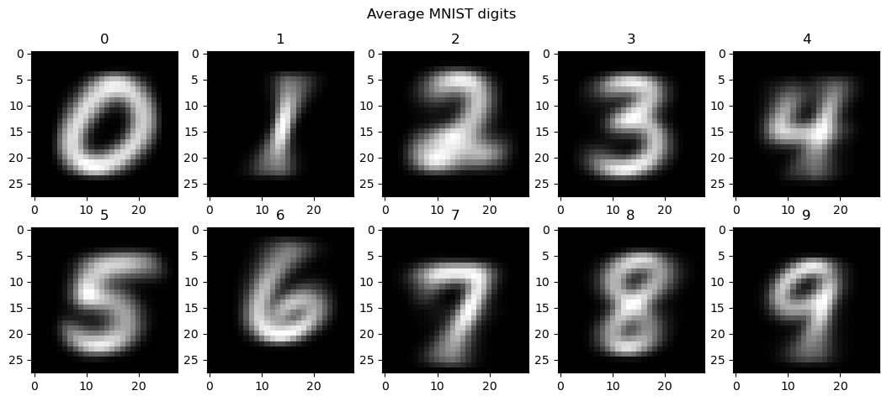
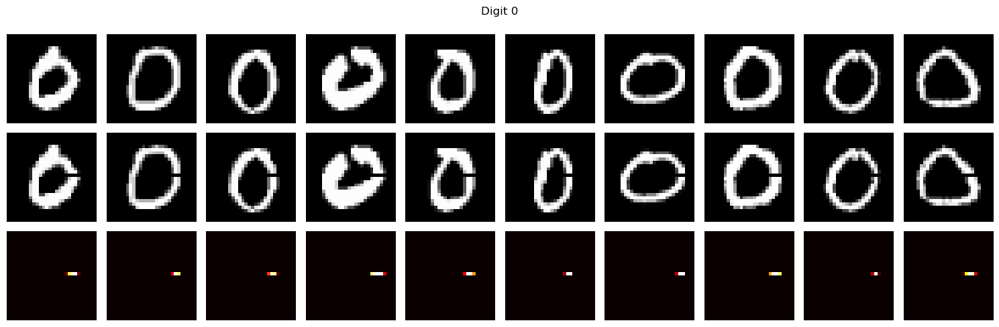
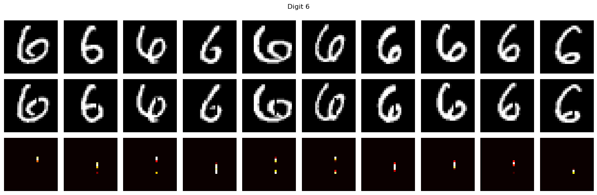
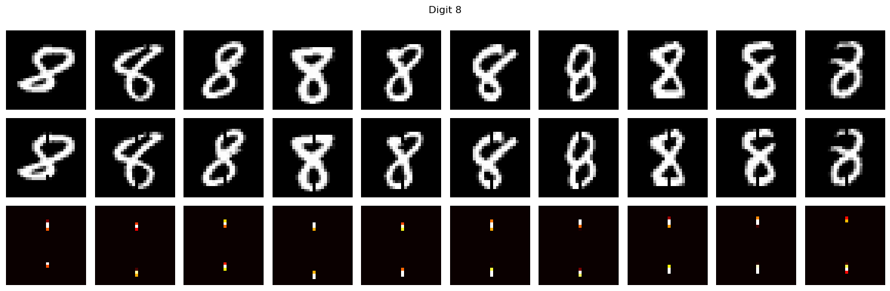
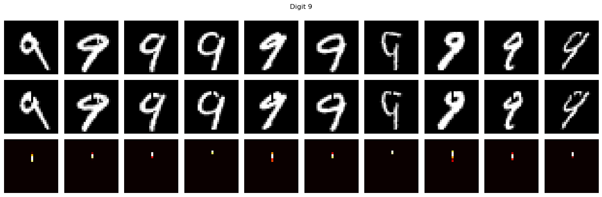

# Intro
I intended this project as an introduction to mechanistc interpretability. I wanted to start with an extremely simple model. 

I decided to investigate an MLP trained on the MNIST dataset. My research question was 'can the MLP recognise closed loops in numbers?'. The digits (0, 6, 8, 9) all contain loops in all styles (I excluded 4 because of the two styles). I investigated whether the model could recognise the closed loops in these numbers.
I was vaguely inspired by this research paper [https://distill.pub/2021/multimodal-neurons/]

This research took about 6 weeks to complete and produced several quite chaotic Jupyter notebooks. I recommend looking at the writeup notebooks if you just want the results and the others if you're curious about how I decided on my final lines of investigation

# Methodology of the writeup notebook
My investigation went like this

1) I took an MLP which had been pretrained on MNIST to recognise digits with 99% accuracy

2) I put pytorch hooks on all layers and recorded all activations for all digits the test dataset

3) I then took only the activations on the first layer for the loopy digits, averaged them, and then plotted them to view the digit

4) I then sorted the first layer neuron activations for all the loopy digits by strength and plotted them

5) I then plotted the highest activating 256, 128, 64, 32, 16, 8, and 4 neurons that were common to all the loopy digits

6) There were no common neurons between loopy digits when I plotted less than 64 neurons 

7) However, it was possible that the loop detector feature could exist in the lower strength neurons. I was looking for a pattern that would look like a 0 superimposed around an 8. While there was no singular neuron that showed that pattern, it would have been possible to construct a loop detector using what was there

8) I then moved on to investigate other layers 

9) I did this by taking the first 10 samples for each loopy digit and making minimal interventions to break the loops 

10) I then applied those interventions to everything else in the test dataset. By the bayesian theorem, I would have between 26 and 0% failure rate. It was particularly difficult to make accurate interventions of 8 and 6

11) I then used my code from step 2 and recorded the activations from running the modified loopy digits through the model

12) The logit outputs from the broken digits were virtually identical to the normal ones. The only difference was a 4% confidence drop with 9 classification. I believe this may have had something to do with the difficulty in getting interventions onto 9

TODO - investigate where the extra probability went to

13) I then calculated the cosine similariy between each layer with normal and broken-loop activations

14) The activations were virtually identical with all values higher than 0.985. 

15) Therefore, breaking the loops had almost no difference on activations on all layers 

16) Therefore, the loop detector does not exist

# Results 

If there is a loop detector feature, it is very very weak. I believe it doesn't exist 

tldr; it doesn't exist

# How did I use AI?
I used AI to write the plotting functions and solve syntax errors. I wrote all the interpretability code and planned experiments myself but got sanity checks from AI.

# Acknowledgements
I'd like to thank my friends for letting me bounce ideas off them and checking my reasoning

 
