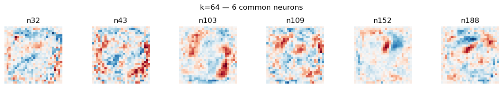
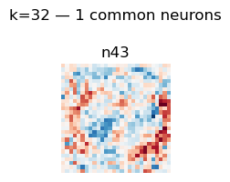
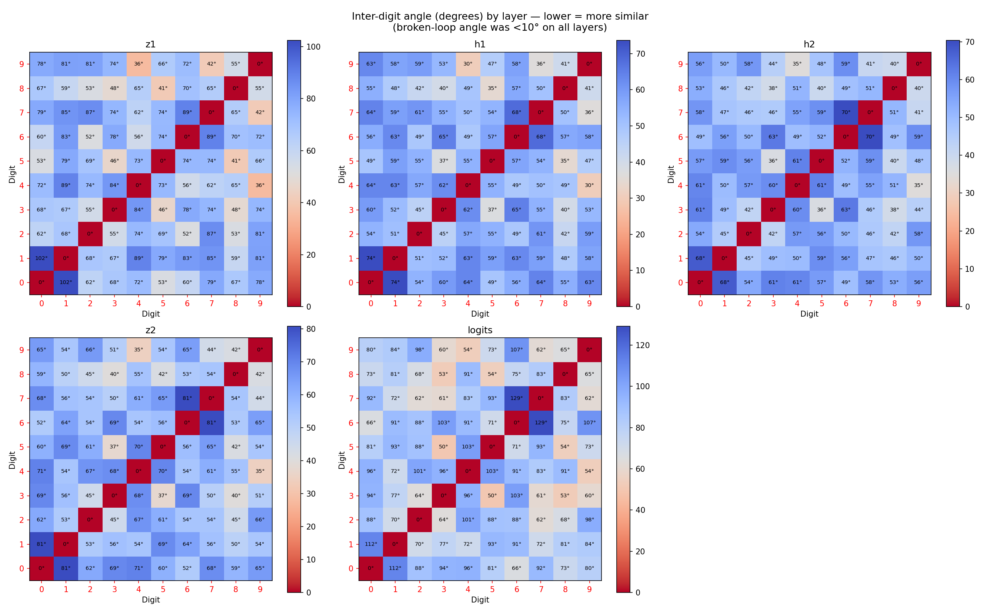

# Intro
I intended this project as an introduction to mechanistc interpretability. This is a field which investigates on understanding how neural networks perform tasks. I wanted to start with an extremely simple model. 

I decided to investigate an MLP trained on the MNIST dataset. My research question was 'can the MLP recognise closed loops in numbers?'. The digits (0, 6, 8, 9) all contain loops in all styles (I excluded 4 because of the two styles). I investigated whether the model could recognise the closed loops in these numbers.
I was vaguely inspired by this research paper [https://distill.pub/2021/multimodal-neurons/]

This research took about 6 weeks to complete and produced several quite chaotic Jupyter notebooks. I recommend looking at the writeup notebooks if you just want the results and the others if you're curious about how I decided on my final lines of investigation

# Methodology of the writeup notebook
My investigation went like this

1) I took an MLP which had been pretrained on MNIST to recognise digits with 99% accuracy

2) I put pytorch hooks on all layers and recorded all activations for all digits in the test dataset

3) I then plotted the pixel averages of all digits

4) I then sorted the first layer neuron activations for all the loopy digits by strength and found the neurons that ranked in the top-k activations for every loopy digit simultaneously, for k = 256, 128, 64, 32, 16, 8, and 4

*k=64: the 6 neurons ranking in the top 64 activations for all four loopy digits*

*k=32: the 1 neuron ranking in the top 32 activations for all four loopy digits*

5) There were no common neurons between loopy digits when I plotted less than 32 neurons 

6) However, it was possible that the loop detector feature could exist in the lower strength neurons. I was looking for a pattern that would look like a 0 superimposed around an 8. While there was no singular neuron that showed that pattern, it would have been possible to construct a loop detector using what was there

7) I then moved on to investigate other layers 

8) I did this by taking the first 10 samples for each loopy digit and making minimal interventions to break the loops 

9) I then applied those interventions to all other loopy digits in the test dataset. As I was able to successfully intervene on 10/10 random samples (the order of digits in the dataset is random and thusBy the Bayesian theorem, I will have between 26% and 0% failure rate in applying the interventions. See notebook 6 for how this number was reached. It was particularly difficult to make accurate interventions on 8 and 6

10) I then used my code from step 2 and recorded the activations from running the modified loopy digits through the model

11) The logit outputs from the broken digits were virtually identical to the normal ones. The only difference was a 4% confidence drop with 9 classification, with almost all of the lost confidence being distributed to 4. This is consistent with the repesentation of the average 4 and 9 being visually similar. Both of them have an enclosed upper region and approximately straight vertical section. I believe that intervention on 9 occasionally disrupts a neuron that differentiates between them. This would cause the model to confuse broken 9s with 4s. 

12) I then calculated the cosine similarity between each layer with normal and broken-loop activations

13) The activations were virtually identical with all values higher than 0.985. This is equivalent to 10.2 degrees.

14) To interpret whether >0.985 cosine similarity means "no change", I computed a baseline: the pairwise angular distance (in degrees) between mean activations for all 10 digit classes at every layer. Cosine similarity is nonlinear near 1.0, so angles give a more honest comparison.

15) Broken-loop digits sit within 10° of their unbroken counterparts at every layer. The closest inter-digit pair (4 vs 9) is 30° apart, and the mean inter-digit separation is 54°. The intervention moved representations 3–5× less than the distance between the two most similar digit classes in the model. The null result is conclusive.

16) The 4 vs 9 angular proximity (30°, the smallest inter-digit gap) directly supports the interpretation of the broken-9 confusion: those two digits are already close in representation space, so the intervention occasionally tips samples across the boundary.

17) Therefore, the loop detector does not exist or is very weak.

# Results 

There is no meaningful loop detector feature. Breaking loops moved representations by less than 10° at every layer. The closest inter-digit pair in the model (4 vs 9) is 30° apart — 3× further than the largest broken-loop effect. The intervention made no representational difference at any level of the network.

# Other insights gained

I have quite a good idea of how the model works. I believe that it could be accurately represented by a series of IF statements about the values of neurons. In other words, I believe that there are coarse stroke detectors and a few critical neurons which focus on a few pixels that can flip a classification. I believe this because of the 4/broken 9 classification mistakes and the failure of quite small random interventions to make a significant difference to classifcation.  

# How did I use AI?
I used AI to write the plotting functions and solve syntax errors. I wrote all the interpretability code and planned experiments myself but got sanity checks from AI.

# Further research
I'm personally not going to spend any more time on MNIST interp because I want to work on LLMs. However, if the reader is interested, I suggest they investigate the relative importance of broad strokes vs individual neurons in classifications. To give them an example research question 'What is the minimum intervention that can be made on a 9 to make the model classify it as a 4?'. 
 
